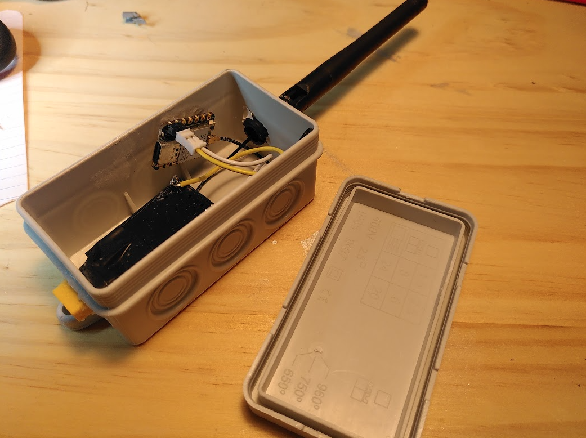

# Wifi Access point 
Goal: to make an outdoor Wifi repeater. 

# Bill of Materials

| Item                              | 2023 price   |
|-----------------------------------|--------------|
| Microprocessor ESP32-C3            | 5 Eur       |
| Transformer 240V AC - 5v DC        | 3.3 Eur     |
| Antena WiFi  2.4GHz 3dBi with I-PEX connection   | 3.4 Eur |
| IP 65 box                          | 1 Eur       |
| Cable and plug                     | -           |

Total: 13 Euros 

# Step-by step

## Software

## Hardware 
