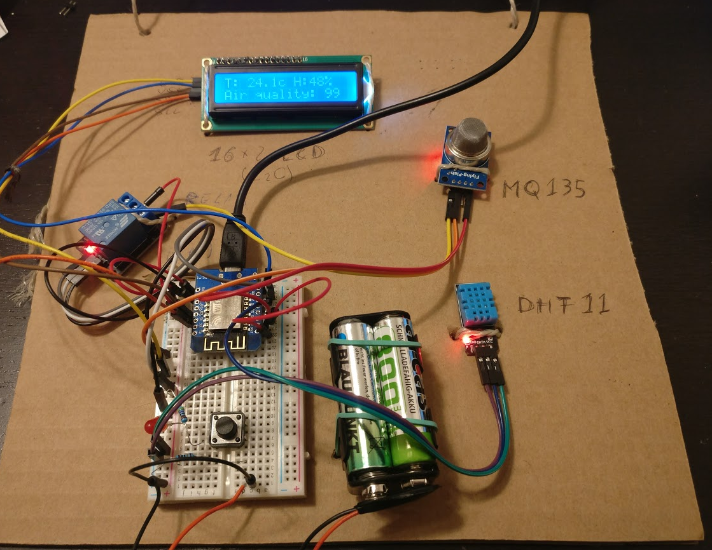

# Sensor Box

The Sensor Box is a compact device designed to collect environmental data and send it to a server over the internet. It utilizes the ESP8266 microcontroller (specifically the Wemos D1 Mini) to interface with various sensors, including the DHT11 for temperature and humidity measurements, and the MQ135 for air quality monitoring.

## Features 📊

- Utilizes the ESP8266 microcontroller for WiFi connectivity.
- Measures temperature and humidity with the DHT11 sensor.
- Monitors air quality using the MQ135 sensor.
- Capable of sending data securely to a remote server.
- Supports deep sleep mode for power efficiency in battery-operated setups.

## Setup 🛠

To get started with the Sensor Box, ensure that you have the necessary hardware components assembled and the required libraries installed in your development environment. Configure the WiFi credentials and server information in the `config.h` file, and upload the firmware to the ESP8266. Detailed instructions on the hardware setup and firmware configuration are provided in the code comments.

## Usage 📡

Once configured and powered on, the Sensor Box will begin to take measurements at regular intervals. The data is then sent to the specified server, where it can be stored and analyzed. The device can operate in continuous mode or use deep sleep to conserve battery life when deployed in remote locations.

## Latest Changes 🔄

- Added a picture of the open sensor box to the repository.
- Implemented a WiFi repeater bootstrap process.
- Integrated an LED controller for visual status indicators.
- Updated the README file with the latest project information.
- Relocated libraries for better organization within the project structure.

## TODOS 📝

- Calibrate battery level reading for outdoor sensor accuracy.
- Implement error handling for WiFi and server connection stability.
- Optimize power consumption for long-term deployment.

**AI-generated by [LLM README](https://github.com/leonardoandrade/llm_readme)**